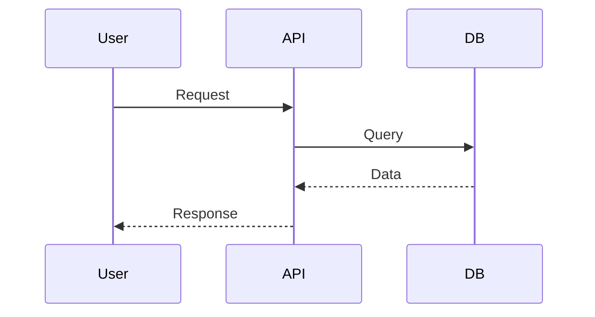
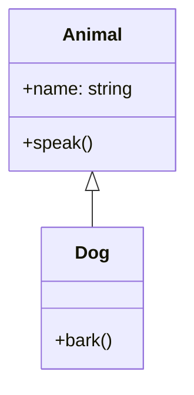

## Slidev Markdown Syntax

### Slide Separators

Use `---` padded with blank lines to separate slides. The first `--- ... ---` block is the **headmatter** (configures the whole deck). Subsequent `--- ... ---` blocks are **frontmatter** for individual slides.

### CRITICAL: Frontmatter Format

Every slide with frontmatter MUST wrap its YAML in `--- ... ---`. A single `---` is NOT sufficient — the YAML will render as visible text on the slide.

**Correct:**
```markdown
---
theme: seriph
title: My Talk
---

---
layout: cover
background: /hero.png
---

# Slide 1 (cover)

Content here

---
layout: center
class: text-white
---

# Slide 2

Content here

---

# Slide 3 (no frontmatter)
```

**WRONG — frontmatter will appear as text on slides:**
```markdown
---
theme: seriph
title: My Talk
---

layout: cover

# Slide 1 (cover)
```

Rules:
1. Headmatter: `---` ... `---` (always wrapped)
2. Slide with frontmatter: `---` ... `---` with YAML inside, then content after closing `---`
3. Slide without frontmatter: just start with content (a single preceding `---` separates it from the previous slide)
4. The first slide after headmatter needs its own `--- ... ---` frontmatter block — do NOT place YAML directly after the headmatter's closing `---`

### Headmatter Options
```yaml
theme: seriph          # Theme name
title: My Talk         # Presentation title
info: Description      # Subtitle/description
author: Name           # Author
keywords: word,word    # SEO keywords
exportFilename: talk   # Default export filename
download: true         # Show download link
export:                # Export defaults
  format: pdf
  timeout: 60000
drawings:              # Whiteboard
  enabled: true
  persist: true
transition: slide-left # Default transition
mdc: true              # MDC syntax
class: text-center     # Default class
fonts:                 # Custom fonts
  sans: 'Roboto'
  serif: 'Roboto Slab'
  mono: 'Fira Code'
```

### Per-Slide Frontmatter
```yaml
layout: cover          # Layout to use
class: text-center     # CSS classes
transition: slide-left # Transition animation
background: /img.png   # Background image (path in public/)
backgroundSize: cover  # Background size
clicks: 5              # Number of click steps
dragPos: 50,50,100,100 # Draggable position
src: ./page.md         # Import from external file
```

### Presenter Notes
Comment blocks at the end of each slide become notes:
```markdown
# My Slide

Content

<!-- This is a **presenter note** - supports markdown -->
```

## Built-in Layouts

| Layout | Description | Usage |
|--------|-------------|-------|
| `cover` | Cover page with title, subtitle, background | Hero slides |
| `intro` | Introduction with title and info | Opening |
| `center` | Vertically and horizontally centered content | Statements, quotes |
| `section` | Section divider with large centered title | Between topics |
| `fact` | Large fact/number with description | Statistics |
| `quote` | Blockquote styling | Citations |
| `two-cols` | Two columns side by side | Comparisons, code+text |
| `two-cols-header` | Two columns with a shared header | Split content with title |
| `image-right` | Image on right, content on left | Illustrations |
| `image-left` | Image on left, content on right | Illustrations |
| `none` | No layout — full control | Custom designs |

### Two-cols Usage
```markdown
---
layout: two-cols
---

# Left Column

Left content

::right::

# Right Column

Right content
```

## Custom Layouts (project-specific)

### hero-center
Full-screen hero with centered content and optional SVG background.
```yaml
---
layout: hero-center
backgroundSvg: /hero-bg.svg
---
```
Slots: default (centered content)

### stat-grid
Grid layout optimized for StatCard components.
```yaml
---
layout: stat-grid
---
```

### side-by-side
Two columns with a thin vertical divider.
```yaml
---
layout: side-by-side
---
```
Slots: default (left), `::right::` (right)

### full-image
Image/SVG fills entire slide with text overlay.
```yaml
---
layout: full-image
imageUrl: /diagram.svg
---
```

## Custom Components

### StatCard
```html
<StatCard value="99.9%" label="Uptime" color="#10b981" />
<StatCard value="2.5M" label="Users" icon="👥" />
```
Props: `value: string`, `label: string`, `icon?: string`, `color?: string`

### Timeline
```html
<Timeline>
  <template #item-1>
    <strong>2020</strong> — Project started
  </template>
  <template #item-2>
    <strong>2022</strong> — Major release
  </template>
  <template #item-3>
    <strong>2024</strong> — Industry standard
  </template>
</Timeline>
```

### ComparisonTable
```html
<ComparisonTable
  :headers="['Feature', 'Basic', 'Pro']"
  :rows="[
    ['Users', '5', 'Unlimited'],
    ['Storage', '1GB', '100GB'],
    ['Support', 'Email', '24/7'],
  ]"
/>
```

### ImageGrid
```html
<ImageGrid :cols="2" gap="4">
  
  
  
  
</ImageGrid>
```
Props: `cols?: number` (default 2), `gap?: string` (default "4")

### SectionNumber
```html
<SectionNumber :number="1" title="Introduction" />
```
Props: `number: number`, `title: string`

## Themes

| Theme | Package | Style | Best for |
|-------|---------|-------|----------|
| `seriph` | `@slidev/theme-seriph` | Clean minimal | Tech talks, general purpose |
| `apple-basic` | `@slidev/theme-apple-basic` | Apple simplicity | Product presentations |
| `default` | `@slidev/theme-default` | Standard Slidev | Generic use |
| `bricks` | `@slidev/theme-bricks` | Structured blocks | Education, structured content |
| `dracula` | `slidev-theme-dracula` | Dark purple | Dark-themed, developer talks |

## Animations & Clicks

### v-click Directive
```html
<div v-click>Appears on click 1</div>
<div v-click>Appears on click 2</div>
```

### v-click.hide
```html
<div v-click.hide>Hides on click</div>
```

### Click Markers in Markdown
```markdown
# Slide Title

<!-- click -->

First point

<!-- click -->

Second point
```

### Transitions
Available transitions: `slide-left`, `slide-right`, `slide-up`, `slide-down`, `fade`, `fade-out`, `zoom`, `none`

Set globally in headmatter or per-slide:
```yaml
transition: slide-left
```

## SVG Inline

Embed SVG directly in markdown for custom illustrations:
```html
<div class="flex justify-center">
  <svg width="200" height="200" viewBox="0 0 200 200">
    <circle cx="100" cy="100" r="80" fill="#7c3aed" opacity="0.2" />
    <circle cx="100" cy="100" r="50" fill="#7c3aed" opacity="0.4" />
    <circle cx="100" cy="100" r="20" fill="#7c3aed" />
    <text x="100" y="105" text-anchor="middle" fill="white" font-size="14">Core</text>
  </svg>
</div>
```

For complex SVGs, save to `public/` and reference:
```markdown
---
layout: full-image
imageUrl: /architecture.svg
---
```

### SVG Design Tips
- Use viewBox for responsive scaling
- Keep viewBox consistent (e.g., `0 0 800 600`)
- Use currentColor for theme-compatible colors
- Group related elements with `<g>`
- Use opacity and gradients for depth
- Animate with CSS transforms

## Mermaid Diagrams

```markdown
```mermaid
graph TD
    A[Start] --> B{Decision}
    B -->|Yes| C[Action 1]
    B -->|No| D[Action 2]
    C --> E[End]
    D --> E
`` `

### Common Diagram Types

**Flowchart:**
```mermaid
graph LR
    Client --> API --> Service --> DB
```

**Sequence:**


**Class:**


## UnoCSS Quick Reference

### Layout
- `flex`, `grid`, `block`, `inline-flex`
- `flex-col`, `flex-row`, `flex-wrap`
- `justify-center`, `justify-between`, `justify-around`
- `items-center`, `items-start`, `items-end`
- `gap-2`, `gap-4`, `gap-8`

### Spacing
- `p-2`, `p-4`, `p-8`, `px-4`, `py-2`
- `m-2`, `m-4`, `m-auto`, `mx-auto`
- `w-full`, `h-full`, `w-1/2`, `h-screen`

### Typography
- `text-xs`, `text-sm`, `text-base`, `text-lg`, `text-xl`, `text-2xl`, `text-4xl`, `text-6xl`
- `font-bold`, `font-semibold`, `font-light`
- `text-center`, `text-left`, `text-right`
- `text-white`, `text-gray-500`, `text-primary`
- `tracking-tight`, `tracking-wide`
- `leading-tight`, `leading-relaxed`

### Colors (common)
- `bg-blue-500`, `bg-green-500`, `bg-red-500`, `bg-purple-500`
- `bg-opacity-50` for transparency
- `text-white`, `text-black`, `text-gray-*`
- Use CSS variables: `text-[var(--slidev-theme-primary)]`

### Visual
- `rounded`, `rounded-lg`, `rounded-full`
- `shadow`, `shadow-lg`, `shadow-xl`
- `border`, `border-2`, `border-gray-200`
- `opacity-50`, `opacity-75`
- `transform`, `rotate-45`, `scale-110`
- `transition`, `duration-300`

### Position
- `absolute`, `relative`, `fixed`
- `top-0`, `bottom-0`, `left-0`, `right-0`
- `inset-0`
- `z-10`, `z-50`

## Workspace Hygiene (CRITICAL)

Before starting work on a **new** presentation, you MUST clean stale assets from previous runs so old images/diagrams do not leak into the new deck.

1. Empty the `public/` directory **except** `.gitkeep`:
   ```bash
   find public -mindepth 1 ! -name '.gitkeep' -delete
   ```
2. Empty the `output/` directory **except** `.gitkeep`:
   ```bash
   find output -mindepth 1 ! -name '.gitkeep' -delete
   ```
3. Verify cleanup succeeded by listing both directories.

## Design Principles

1. **One idea per slide** — never overload
2. **Visual hierarchy** — title > subtitle > content > detail
3. **Breathing room** — generous padding, whitespace is not wasted space
4. **Contrast** — light on dark, dark on light. Never gray on gray
5. **Consistency** — same fonts, colors, spacing across all slides
6. **Minimal text** — bullets ≤ 6 words, never paragraphs
7. **Strong covers** — first slide sets the tone
8. **Section dividers** — break long presentations into digestible chunks
9. **Close with impact** — final slide should be memorable (not "Thank You" + "Questions?")
10. **SVG over raster** — vector graphics scale perfectly

## Export

```bash
bun run export:pdf    # PDF to ./output/microservices.pdf
bun run export:pptx   # Editable PPTX to ./output/microservices.pptx
bun run export:png    # PNG slides to ./output/microservices/1.png, 2.png, ...
bun run export:all    # All supported formats
```

### Editable PPTX Contract

- `bun run export:pptx` now builds the default PowerPoint artifact from `output/<slug>.deck-spec.json`.
- The deck spec must exist and satisfy `schemas/deck-spec.schema.json`.

### ⚠️ CRITICAL: Slidev v52.x Blank First Page Bug

Slidev v52.14.2 (and nearby versions) always generate a blank first page/frame in exported PDF and PNG **regardless** of settings. To avoid this:

1. **Avoid `v-click`** in slides intended for export — it creates intermediate "step 0" frames that appear empty.
2. **Set `export.withClicks: false`** in the headmatter:
   ```yaml
   ---
   theme: dracula
   export:
     withClicks: false
   ---
   ```
3. **Avoid `transition: fade` on the cover slide** — the screenshot may catch the slide mid-animation.
4. **Always use `--wait 1500`** (or higher) to give backgrounds and Mermaid diagrams time to render.

The project includes `scripts/fix-export.mjs` which is automatically invoked after `export:pdf` and `export:png` to remove the blank first page and shift PNG numbering. **Always use the `bun run export:*` scripts** instead of calling `slidev export` directly.

### PNG Export (individual slide images)

**CRITICAL:** PNG export MUST use `--wait-until networkidle` (not `load`) to ensure all slides are fully rendered before capture. In this project, always use the wrapper script instead of calling `slidev export` yourself:

```bash
bun run export:png
```

Then verify the output directory is non-empty:
```bash
ls -la ./output/my-presentation/
```

This creates a directory with numbered PNG files:
```
output/
└── my-presentation/
    ├── 1.png
    ├── 2.png
    └── 3.png
```

The directory name is derived from the presentation title (slugified).

CLI options:
- `--timeout 60000` — increase for large presentations
- `--with-clicks` — export each click step as separate page (AVOID — causes blank pages)
- `--dark` — export with dark mode
- `--range 1,3-5` — export specific slides only
- `--output ./path/name` — custom output path (for PNG, this is the directory)
- `--wait 1500` — REQUIRED delay for cover backgrounds and Mermaid diagrams
- `--wait-until networkidle` — REQUIRED for PNG export to prevent empty output directory
